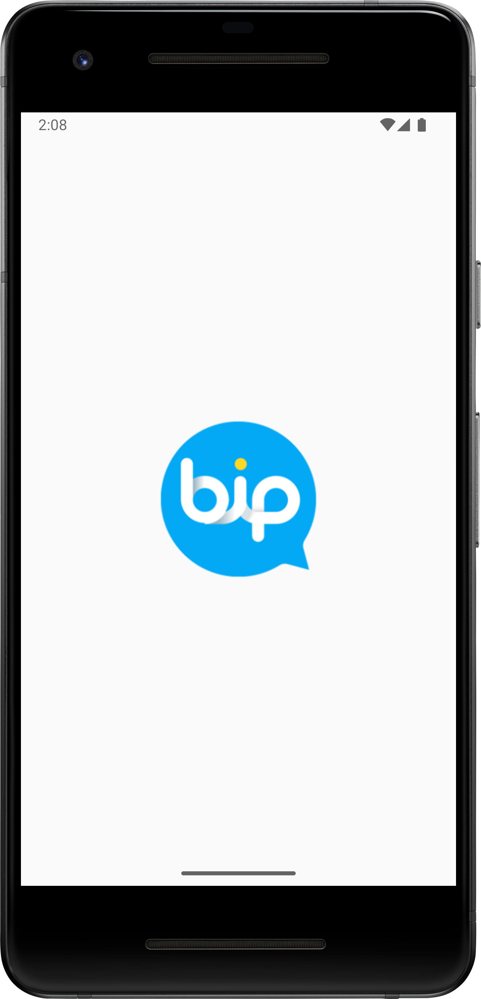
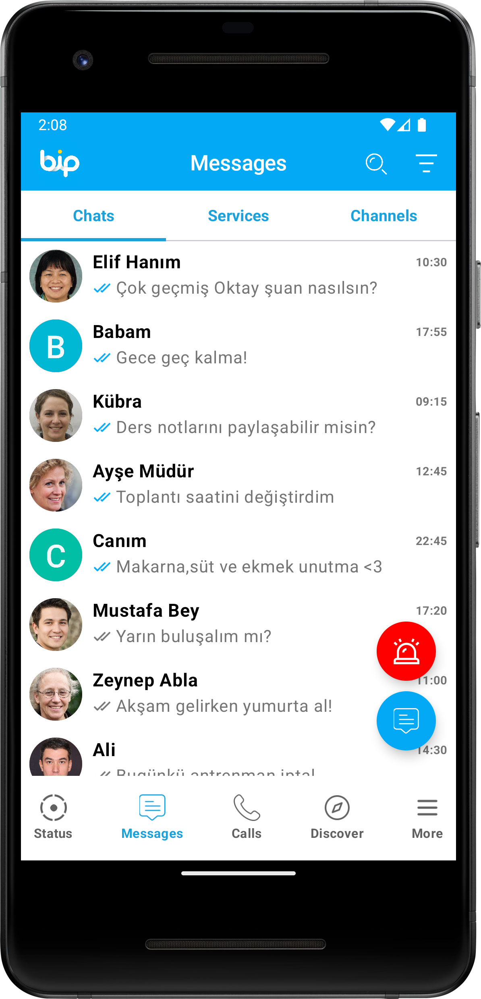
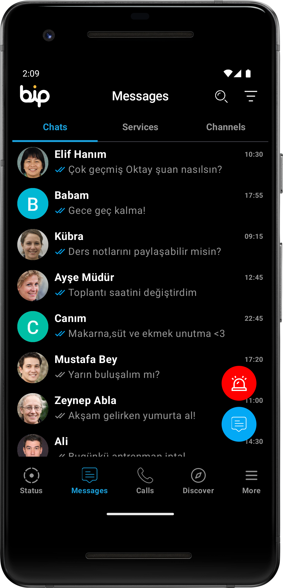
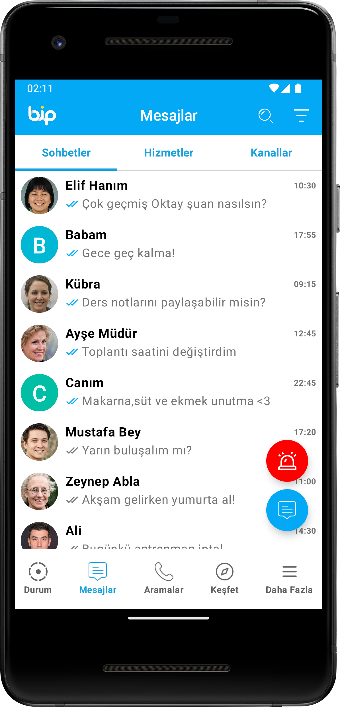
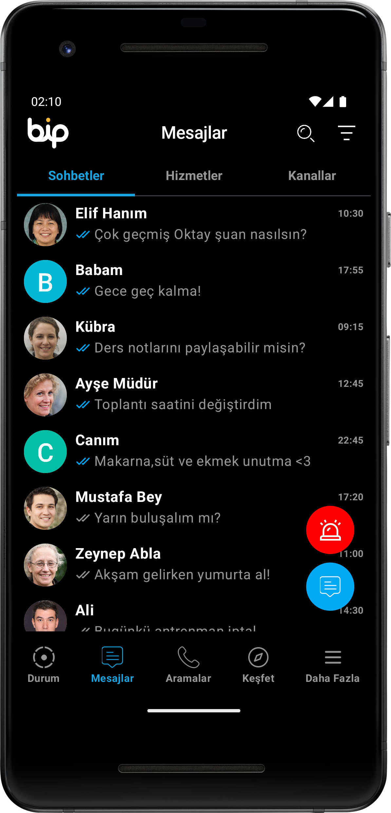

# 
 Bip App Clone 

## 📸 Screenshots
<table>
    <tr>
        <td align="center">
            <strong><h2>Splash</h2></strong>
            
        </td>
        <td align="center">
            <strong><h2>Light English Screen</h2></strong>
            
        </td>
        <td align="center">
            <strong><h2>Dark English Screen</h2></strong>
            
        </td>
    </tr>
    <tr>
        <td align="center">
            <strong><h2>Light Türkçe Screen</h2></strong>
            
        </td>
        <td align="center">
            <strong><h2>Dark Türkçe Screen</h2></strong>
            
        </td>
</table>

## ✨ Uygulama Özellikleri

- **Dark Theme:** Uygulama, karanlık tema desteği sunar ve kullanıcıların göz yorgunluğunu azaltır.
- **English & Türkçe Desteği:** Uygulama, İngilizce ve Türkçe dillerinde kullanılabilir.
